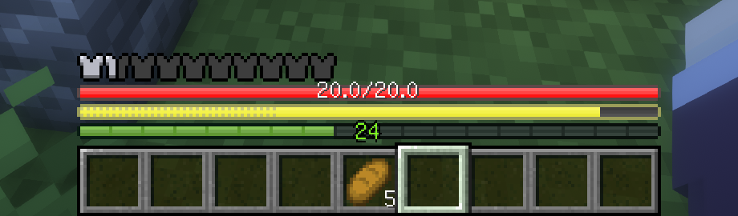

# AsteorBar

A simple mod to display player's status using slim bars.

## Features

- Vanilla feel. Bars can blink as vanilla hearts do(on regen health, on hurt, and so on).
- Display health, hunger, mount health and more.
- Change the color of the bars while be with regeneration, poison, wither or starvation effects. Frozen also supported.
- Won't be affected by max health. Suitable for situations with high max health.
- Display health and absorption together.
- Display saturation and exhaustion together with hunger.
- Display experience value.
- Bars will flash when the player has low health or hunger.
- Configurable. You can change whether to display some bars.

## Notes

To make the mod work on Spigot servers, this [plugin](https://github.com/afoxxvi/AsteorBarServer) is needed for the server.

## Plans

- [ ] Multiple layouts
- [x] Exhaustion display
- [x] Armor display
- [x] Configurable
- [ ] Support some older versions(1.16.5, 1.14.4...)

The following features are not planned to be implemented by now.

- [ ] Fabric API support
- [ ] Color customization
- [ ] Very old versions support(<1.12.2)

## Screenshots

Absorption display together with health.

Exhaustion display together with hunger(Similar to AppleSkin).

Saturation display together with hunger.

Mount health.

Air level.

Regeneration effect.

## Acknowledgements

The mod is inspired by

- [AppleSkin](https://github.com/squeek502/AppleSkin) by squeek502