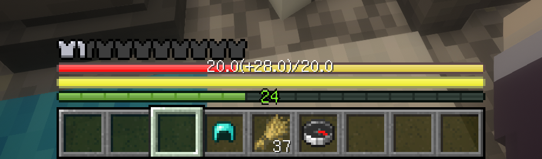
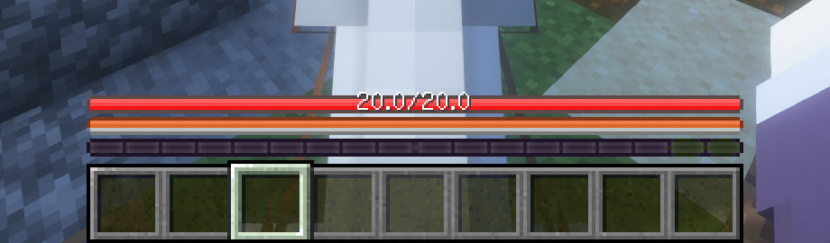
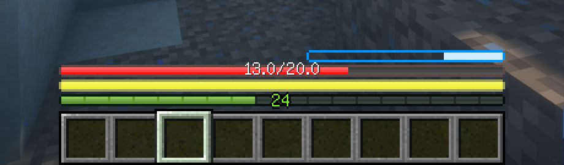
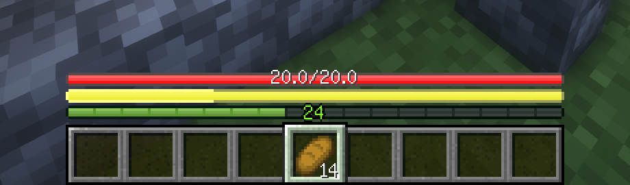
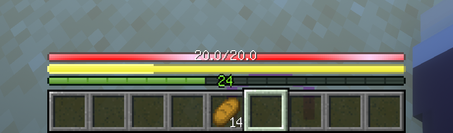

# AsteorBar

A simple mod to display player's status using slim bars.

## Features

- Display health, hunger, mount health and air level.
- Change the color of the bars when have regeneration, poison or wither effects. Frozen also supported.
- Not affected by max health.
- Display health and absorption together.
- Display saturation together with hunger.

## Plans

- [ ] Support 1.16.5

## Screenshots

Absorption display together with health.

Mount health.

Air level.

Saturation display together with hunger.

Regeneration effect.
